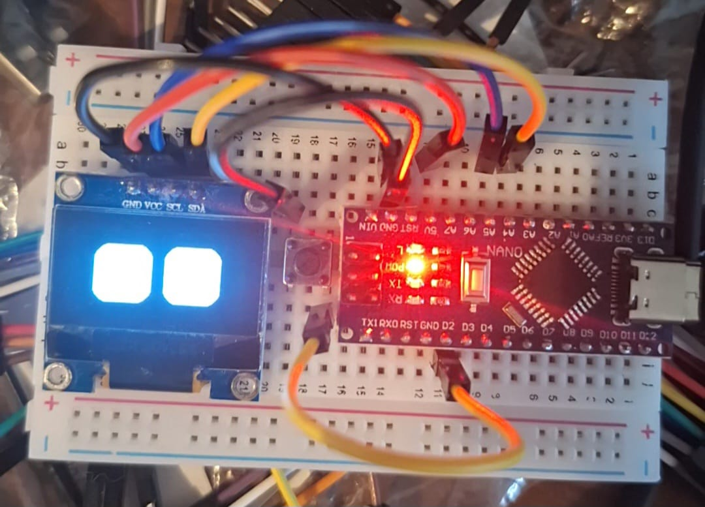

# Bunny OLED Expression Controller

{ width=400px }

This project drives a pair of animated "eyes" on a 128×64 I²C SSD1306 OLED display. A push button cycles through several predefined expressions, while a long press returns the device to automatic random playback.

## Features

- Multiple eye expressions: centered pose, slow blink, fast blink, happy, sad, angry, tired, and heart eyes.
- Short button press steps through the expression list and leaves the chosen look on the display.
- Long button press (held ~5 seconds) resumes automatic random expression cycling.
- Debug output over serial prints whenever the button is pressed.

## Wiring

The sketch expects the following connections (shown for an Arduino Uno-compatible board):

```
              +5V o-----------------------------o OLED VCC
                                                
Arduino D2 o--o/ o Button                       
              |                                 
              o-----------------------------o GND (common ground)
                                                
Arduino GND o----------------------------------o OLED GND
Arduino A4 (SDA) o-----------------------------o OLED SDA
Arduino A5 (SCL) o-----------------------------o OLED SCL
```

- The push button is wired between digital pin 2 and ground. The sketch enables the internal pull-up resistor, so no external resistor is needed.
- The SSD1306 OLED uses the standard I²C pins (A4 for SDA and A5 for SCL on Uno-style boards) and the default address `0x3C`.

## Usage

1. Connect the hardware as shown above.
2. Upload `faces_random_only.ino` to the microcontroller.
3. Open a serial monitor at 115200 baud to observe debug messages when the button is pressed.
4. Tap the button to cycle through expressions. Hold the button for approximately five seconds to re-enable random playback.
